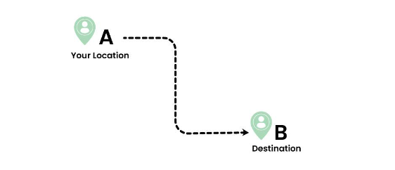
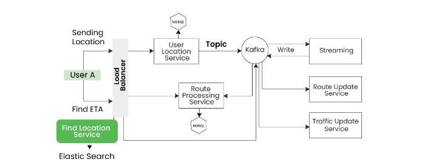

# Google Maps Design

This document outlines the architecture and design of a mapping system, inspired by Google Maps. The system includes real-time location tracking, destination selection, route calculation, and ETA (Estimated Time of Arrival) computation.

## Disclaimer
This documentation is intended solely for interview preparation and basic-level understanding of system design concepts. It is not a comprehensive guide or production-level design for a real-world application like Google Maps. The purpose is to simplify complex concepts so that beginners and those preparing for system design interviews can grasp the fundamental ideas.

Please read and interpret this document within this context and refer to authoritative sources or consult experienced professionals for deeper insights and advanced implementations.

Compressive guide : https://www.geeksforgeeks.org/designing-google-maps-system-design/

## What is Google Maps?
Google Maps is a web mapping service developed by Google. It offers satellite imagery, aerial photography, street maps, 360° interactive panoramic views of streets (Street View), real-time traffic conditions, and route planning for traveling by foot, car, bicycle, or public transportation.
Users can access Google Maps through a web browser on a computer or through the Google Maps mobile app on smartphones and tablets.

## Key Features

- **Real-time Location Tracking**: Continuously tracks the user’s current location.
- **Destination Selection**: Allows users to select a destination.
- **Path Calculation**: Calculates the optimal route, distance, and ETA.

### Path Calculation Methods:

#### Method 1 - Dijkstra's Algorithm
- Dijkstra's algorithm is known for finding the shortest path in graphs. However, it is inefficient for large-scale real-world maps due to its computational complexity.
- In maps with millions of nodes (intersections, roads), Dijkstra's can be slow, and thus, more efficient algorithms like **A\* Search** or **Contraction Hierarchies** are typically used.

#### Method 2 - Caching
- Storing every possible route in a cache is impractical, as the cache size would be immense given the number of users and dynamic paths.
- A **distributed caching strategy**, where frequently accessed routes are stored and managed across multiple servers, is more viable.

#### Method 3 - Partial Caching of Key Routes
- We can cache important route segments, such as entry and exit points between key regions.
- However, the challenge of estimating ETA accurately persists, as it is influenced by dynamic factors like traffic, weather, and road conditions.

### Optimized Approach:
- Ignoring dynamic variables (e.g., traffic, road construction), we can first focus on calculating the distance between two points.
- For efficient spatial data storage and lookup, a **Quad Tree** can be employed for geographical indexing, though actual route computation would use graph-based algorithms.

#### Quad Tree Explanation:
- A Quad Tree efficiently stores 2D spatial data by recursively dividing space into quadrants. Each node in the tree can have up to four children, and the structure helps efficiently locate nearby points in large geographical areas.

#### Example:
If a user wants to travel from Region 1 to Region 3, the map calculates entry and exit points from Region 1 to Region 2, and Region 2 to Region 3. It computes the distance from the user's current location to the entry point of Region 1, and from the exit point of Region 3 to the final destination.

### ETA Calculation:
- To calculate ETA, we use **real-time traffic data** gathered from users on the same route.
- By computing the mean deviation of travel times, we can estimate ETA accurately.

---

## Services Overview

### 1. User Location Service
- Continuously tracks the user’s location and updates the map and ETA in real-time.
- Location data is stored in a NoSQL database for fast retrieval and further analysis.

### 2. Route Update Service
- Updates existing routes in the map based on user behavior.
- If users frequently take a more efficient path, the service updates this new route in the NoSQL database.

### 3. Location Search Service
- Returns the latitude and longitude of a location.
- Uses **Elasticsearch** with the `geo_point` data type to store and query locations efficiently.
- Supports **Bounding Box Search**, which finds points within a rectangular area.

### 4. Historical Traffic Info
- Based on stored logs, historical traffic data can be analyzed to predict ETA for future users.

### 5. Traffic Update Service
- Sends real-time traffic updates to the database for use in ETA calculations.

### 6. Route Processing Service
- Computes the optimal route and ETA between two points, considering dynamic factors like traffic.

### 7. Navigation Tracking Service
- Tracks the user’s navigation in real-time.
- If the user deviates from the suggested route, the service dynamically adjusts and provides the updated route.

---

## Lower-Level Design

### User Location Flow:

- Users send their location to the **Load Balancer** → forwards the request to the **User Location Service** → data is stored in a **NoSQL** database (used for ETA prediction based on aggregated user locations).

---

### Streaming Architecture:

- The **User Location Service** streams data using **Kafka** → processed by **Spark Streaming** for real-time analysis.
- **Kafka** is also responsible for handling updates for the **Route Update Service** and **Traffic Update Service**.

---

### Geospatial Search:

- The **Load Balancer** directs location queries to the **Location Search Service**, which uses **Elasticsearch** to return latitude/longitude values.

---

### Route Processing:

- Requests for route calculations are handled by the **Route Processing Service**, and results are stored in the **NoSQL** database.

## Google Map System Design 

## Important Concepts

### 1. Quad Tree

A **Quad Tree** is a data structure used to partition a two-dimensional space by recursively dividing it into four quadrants or regions. It is particularly useful in applications like geographic information systems (GIS), computer graphics, and spatial indexing.

#### Key Concepts:
- **Recursive Subdivision**: The space is divided into four smaller quadrants. If a quadrant contains multiple data points (like locations on a map), it is further subdivided.
- **Spatial Partitioning**: It helps in organizing spatial data so that points or objects close to each other are grouped together.
- **Efficient Search**: When you need to find a point or a region on a map, Quad Trees allow for quick lookup because the space is divided logically.

#### Example:
Imagine a map divided into four quadrants (north-west, north-east, south-west, and south-east). Each quadrant can further be divided into smaller quadrants to store and search locations efficiently.

---

### 2. Kafka

**Apache Kafka** is a distributed event-streaming platform used to handle real-time data feeds. It’s mainly used for building data pipelines and streaming applications that require high-throughput, fault-tolerant messaging.

#### Key Concepts:
- **Producer and Consumer**: In Kafka, a **producer** sends data (messages) to Kafka, and a **consumer** reads this data.
- **Topics**: Data in Kafka is organized into **topics**, which act like channels to which producers publish data and consumers subscribe.
- **Partitioning**: Each topic is divided into multiple **partitions** for scalability and parallel processing.
- **Fault Tolerance**: Kafka replicates data across multiple servers (brokers), ensuring that data is not lost even if a server fails.

### Use Case:
Kafka is widely used for managing real-time data streams, such as handling user location data or traffic updates in systems like Google Maps.

---

### 3. Streaming

**Streaming** refers to continuously processing data as it is generated, rather than waiting to process data in batches. **Stream processing** ensures that data is handled in real-time, making it crucial for time-sensitive applications like live traffic monitoring.

#### Key Concepts:
- **Real-time Data**: Streaming systems process data immediately as it flows in, such as tracking a user’s location or monitoring traffic patterns.
- **Frameworks**: Technologies like **Apache Kafka Streams**, **Apache Flink**, and **Apache Spark Streaming** are used to process these data streams in real-time.
- **Low Latency**: The primary goal of streaming is to reduce the time it takes from when data is generated to when it is processed and acted upon.

#### Example:
In a mapping application, a streaming system could continuously ingest location updates from users and instantly adjust the map and route recommendations based on real-time traffic conditions.

---

### 4. Load Balancer

A **Load Balancer** is a system that distributes incoming network traffic across multiple servers to ensure no single server is overwhelmed. It ensures high availability, fault tolerance, and optimal resource utilization.

#### Key Concepts:
- **Traffic Distribution**: The load balancer directs requests to different servers (also called **nodes**) based on their current load or availability, ensuring no one server is overwhelmed.
- **Types of Load Balancers**:
  - **Layer 4 Load Balancing**: Operates at the transport layer, distributing traffic based on IP and TCP/UDP ports.
  - **Layer 7 Load Balancing**: Operates at the application layer, distributing traffic based on content, such as HTTP headers or URL paths.
- **Health Checks**: Load balancers continuously monitor the health of servers and only route traffic to servers that are functioning properly.

#### Example:
In a mapping service, a load balancer distributes user requests (e.g., location updates, route calculations) across several backend services, ensuring high availability and low latency.

---

These concepts are crucial for understanding scalable, distributed system designs, especially when dealing with real-time, location-based applications like Google Maps.
